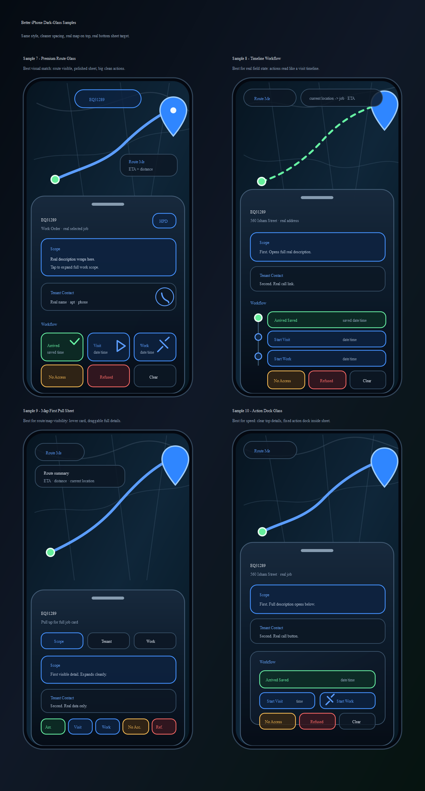
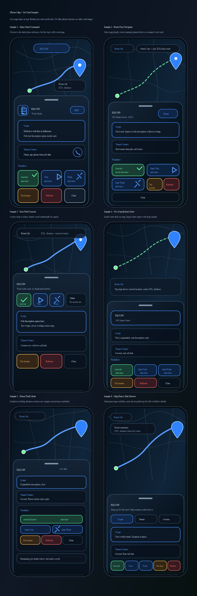

# iPhone Map + Job Card System Plan

This is the source-of-truth plan for the EQ31289 iPhone map/job-card work.

The goal is a real mobile browser field experience: live map on top, real job card on the bottom, fast iPhone scrolling, real actions, real route behavior, and no fake UI/data.

## Design Board



Original first-pass design board:



Design files:

- `docs/design-samples/iphone-map-job-card-samples-v2.png`
- `docs/design-samples/iphone-map-job-card-samples-v2.svg`
- `docs/design-samples/iphone-map-job-card-samples.png`
- `docs/design-samples/iphone-map-job-card-samples.svg`

The design board is only for choosing the target layout. The app must not embed the board, screenshot it, or fake the card.

## Current Design Decision

Selected sample: Sample 7 - Premium Route Glass (working default unless the user changes it)

The user will pick one sample. After that, build the app to match the chosen sample as closely as possible while keeping every control real.

## What We Are Building

A real iPhone-style map + bottom-sheet job card for:

- Local test URL: `http://127.0.0.1:3278/map/?omo=EQ31289&view=all&map=1`
- Primary field case: work order `EQ31289`
- User device target: iPhone Safari/browser-sized mobile viewport

The screen must feel like an iPhone field tool, not a desktop page squeezed down.

## Rebuild Decision

The selected-job mobile experience is being rebuilt instead of patched.

Reason:

- The current selected job drawer has too many overlapping legacy CSS/layout layers.
- Status appears in several different places and can disappear depending on selected mode.
- Incremental visual patches have been slow and brittle.

New rebuild rule:

- Keep the existing real map, real job data, real workflow save functions, real visit tracking, and real route functions.
- Replace the selected-job mobile surface with one clean iPhone field sheet.
- Hide the old selected-job drawer while the rebuild sheet is active so the user sees one job card, one status area, and one workflow.
- Do not remove all-jobs map behavior.
- Do not push or deploy a rebuild slice until it is locally checked in the right browser.

## Active V2 Path

Version 2 is now the default selected-job card.

- Default test URL uses V2: `http://127.0.0.1:3278/map/?omo=EQ31289&view=all&map=1`
- Rollback/compare URL uses V1: `http://127.0.0.1:3278/map/?omo=EQ31289&view=all&map=1&card=v1`

V2 direction:

- Keep the real map and real data/handlers from `MapClient.tsx`.
- Use isolated `.iphone-field-v2-*` CSS and markup so future changes do not keep fighting the old drawer/card CSS.
- Prefer larger two-column workflow buttons over tiny dense controls.
- Keep snap positions: middle, expanded, collapsed-to-map.
- Continue improving V2 only unless the user explicitly asks to compare or roll back to V1.

Current V2.1 interaction slice:

- `omo=EQ31289` must open the exact selected job card, not fall back to the first visible job.
- Scope is a real tappable card that opens a large full-scope panel using the real job description.
- The full-scope panel must close cleanly and return to the same V2 sheet.
- Tenant Contact must show the apartment as a prominent iPhone-readable pill when apartment data exists.

Current V2.2 restore-forward slice:

- The rebuilt V2 card must restore important field modules from the older job card instead of hiding them.
- Job address must be large and easy to read, with real Waze, Google, and in-map route actions beside it.
- Tenant Contact follows the address and keeps the apartment prominent.
- Scope stays tappable and readable.
- Complete Invitation To Bid / original ITB Page 3 must be available from the V2 card and must use the real ITB source image/PDF state.
- Start Work saves Work In Progress and then asks for before media: Take, Upload, or No Media.
- Finish/closeout asks for after media: Take, Upload, or Finish No Media, then the existing package/paperwork review flow handles affidavit and invoice.
- No Access and Refused must prompt for media first, with a real no-media save/close option.

Current V2.3 flexible media slice:

- Start Work must not force a fixed 4-item guided capture set.
- Start Work opens a before-media panel with Take Image, Take Video, Upload, Done Start Job, and No Media Start.
- Before media can be repeated as many times as needed; each saved item must appear as a real thumbnail/preview on the V2 card.
- Done Start Job starts Work In Progress only after before media exists; No Media Start is the explicit no-media path.
- Finish/closeout opens an after-media panel with Take Image, Take Video, Upload, Done Finish, and Finish No Media.
- After media can be repeated as many times as needed; saved after media must appear as real thumbnails/previews on the V2 card.
- Invoice material extraction from the scope/description is the next slice after the job-card media flow is stable.

## Non-Negotiables

- No fake iPhone status bar.
- No fake time, battery, signal, or decorative browser chrome.
- No fake static map image.
- No fake job-card screenshot.
- No fake job data.
- No duplicate action buttons.
- No overlapping text.
- No laggy long-scroll layout.
- All visible controls must be real buttons/links wired to real app behavior.
- The top map must remain visible and usable.
- The bottom job card must scroll quickly and independently.
- Map pan/zoom and card scroll must not fight each other.
- Closing the selected job card must return to the all-jobs map, not leave the user trapped in one-work-order mode.
- The map may be styled for dark glass, but it must still read as a real map with visible streets/tiles, not a black backdrop.

## Required Screen Structure

1. Top area: real live map.
2. Bottom area: real dark-glass job-card sheet.
3. Job-card order:
   - Scope first.
   - Tenant contact second.
   - Workflow third.
4. Remaining job details stay available below through fast native sheet scroll.

## Required Job Card Content

The card must render from real app data/state.

Required fields/sections:

- Work order id.
- Address/building context when available.
- Scope/description first.
- Tenant contact second.
- Workflow third.
- Additional details below the primary field controls.

Scope behavior:

- Starts readable without overlap.
- Can expand to show the full real description.
- Long text wraps cleanly.
- Expanding scope must not cover workflow buttons.

Tenant contact behavior:

- Uses real tenant/contact fields from the selected job.
- Phone action is a real link/button when a phone number exists.
- Missing tenant/contact data must show a real empty state, not invented text.

## Required Workflow Buttons

Workflow appears third and must include:

- Arrived Saved with visible saved date/time area.
- Start Visit with visible date/time area.
- Start Work with hammer/tool visual and visible date/time area.
- No Access.
- Refused.
- Clear.

Rules:

- Each action appears once.
- Button labels must fit on iPhone widths.
- Timestamps must have reserved space so text does not jump or overlap.
- Button feedback must be visible after click/tap.
- Actions must reuse the existing real handlers/state, not a mock handler.

## Route Me Behavior

Route Me must be real.

When Route Me is tapped:

- The top map shows route context where available.
- The app shows current-location-to-job context when available.
- ETA and distance appear when the existing route stack can provide them.
- If location permission or routing data is unavailable, show a real visible message.
- Do not navigate away to Waze/Google unless the UI explicitly provides that action.
- External route links, if shown, must be real links generated from the selected job address/coordinates.

## Mobile Interaction Requirements

Map:

- Top map can pan/zoom normally.
- Route graphics/markers remain visible above the sheet.
- Map controls must not be hidden by fake overlay rules.
- Selected-job mode must leave enough top map visible on both iPhone-sized screens and the right in-app browser.
- The `map=1` test URL is map mode, not permission to fake or black out the map.

Bottom sheet:

- Uses native fast scroll.
- Uses `overflow-y: auto` or equivalent real scrolling.
- Uses iPhone-friendly momentum scrolling where supported.
- Uses touch containment so map pan and sheet scroll do not conflict.
- Has stable dimensions so button hover/tap/feedback does not resize the layout.

Target viewport checks:

- iPhone 12/13 style: around `390 x 844`.
- Large iPhone style: around `430 x 932`.
- Current app browser narrow/short viewport must still remain usable.

## Development Setup

Repo:

- `D:\dev\HPD-Bid-Dashboard-2026`

Local test URL:

- `http://127.0.0.1:3278/map/?omo=EQ31289&view=all&map=1`

Expected local commands:

- `npm run lint`
- `npm run build`
- `npm start -- -p 3278`

Use the in-app browser for visual testing when available. Always test the right URL after each meaningful UI upgrade.

Current scheduler/build/push rule:

- The 1-minute upgrade loop is paused while the selected-job screen is being rebuilt.
- Resume scheduled upgrades only after the rebuild direction is stable enough to test on iPhone.
- Each cycle must make one small verified app improvement or report the exact blocker.
- After code changes, run the relevant lint/build checks before telling the user to test.
- Restart or confirm the local server on port `3278` after build output changes.
- Refresh the right in-app browser at the EQ31289 local test URL after each verified local cycle.
- Save/push only scoped app and plan changes after the real app has been checked.
- Do not push fake UI, fake screenshots, fake data, or a known broken card state.
- Deploy to Cloudflare only when the repo deployment path is available; otherwise report the exact blocker.

## iPhone Testing Setup

For testing from the user's iPhone, use one of these paths:

1. Cloudflare/deployed URL after pushing/deploying the current branch.
2. Local network URL if the dev server is bound to the LAN interface and the iPhone is on the same Wi-Fi.

Localhost note:

- `127.0.0.1` on the iPhone means the iPhone itself, not the development computer.
- For direct iPhone local testing, the app needs a LAN URL such as `http://<computer-lan-ip>:3278/map/?omo=EQ31289&view=all&map=1`.
- For outside-the-house/mobile data testing, use Cloudflare or another public deployment URL.

## Upgrade Work Cycle

Each upgrade cycle should be small enough to test.

1. Read this plan first.
2. Confirm selected sample or the current active decision.
3. Implement one clear UI/behavior slice.
4. Remove any fake/mock UI that affects the real app path.
5. Run lint/build when code changed.
6. Open/test the right URL.
7. Capture what was tested.
8. Send the user a short message:
   - what changed,
   - what URL to test,
   - what specifically to tap/check,
   - known limitations or what remains.

Upgrade message format:

```text
Next upgrade is done.
Test this URL: <url>
Check: <short checklist>
Changed: <short summary>
Remaining: <next thing>
```

## Async / Scheduler Plan

The active automation is a recurring heartbeat attached to this Codex task.

Automation id: `hpd-iphone-map-job-card-upgrade-loop`.

Current cadence: every 1 minute while the active build loop is running.

Purpose:

- Keep working from this plan without the user needing to restate instructions.
- Continue one upgrade cycle at a time.
- Notify in this task when a testable upgrade is ready.
- Ask the user to test from the iPhone and report what is wrong.

Automation rules:

- Always read `docs/IPHONE_MAP_JOB_CARD_SYSTEM_PLAN.md` first.
- Do not invent requirements.
- Do not use fake UI/data.
- Do not send Gmail unless the user explicitly confirms recipient and content.
- After a code change passes local verification, refresh the right browser, commit/push the scoped app changes, and deploy to Cloudflare when the repo deployment path is available. If push or deploy is blocked, report the exact blocker.
- Prefer task message updates first.

Gmail rule:

- Gmail can be used for upgrade notifications only after the user confirms the recipient address and the exact send behavior.
- Drafting is acceptable after confirmation of recipient.
- Sending requires explicit send confirmation.

## Acceptance Checklist

A cycle is not complete unless these are true for the changed area:

- Real map is visible above the job card.
- Job card is real DOM/React UI, not an image.
- Scope is first.
- Tenant contact is second.
- Workflow is third.
- Route Me behavior is real or shows a real unavailable state.
- Buttons are wired to real handlers.
- No duplicate buttons.
- No overlapping text at iPhone width.
- Card scroll is fast and independent from map pan.
- Lint/build pass after code changes, or failure is clearly reported.

## Open Decisions

- Pick the target sample number from the design board.
- Confirm whether upgrade notifications should stay in this Codex task only or also use Gmail.
- Confirm Gmail recipient before any email is drafted or sent.
- Cloudflare deployment is approved after verified app-code upgrades so the user can test from iPhone. Report the deployed URL or exact blocker.


